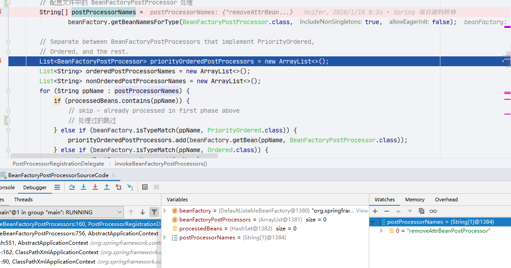
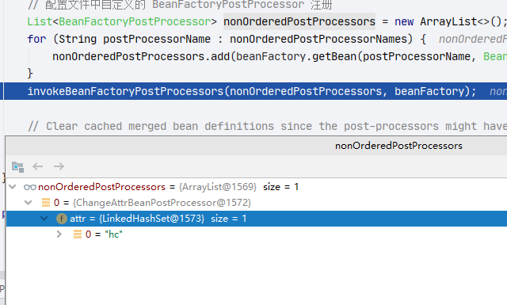
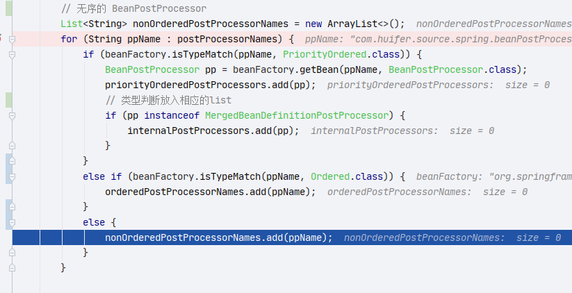
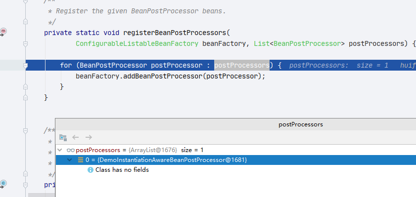
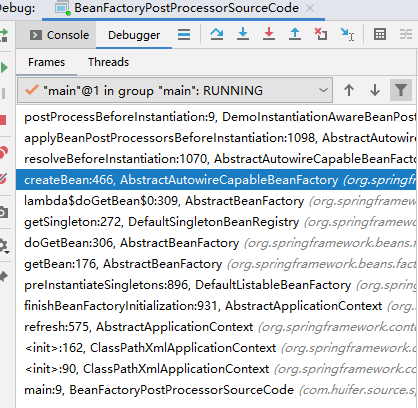

# Spring BeanFactoryPostProcessor
- Author: [HuiFer](https://github.com/huifer)
- 源码阅读仓库: [huifer-spring](https://github.com/huifer/spring-framework-read)
- 作用: 定制或修改`BeanDefinition`的属性


## Demo
```java
public class ChangeAttrBeanPostProcessor implements BeanFactoryPostProcessor {
    private Set<String> attr;

    public ChangeAttrBeanPostProcessor() {
        attr = new HashSet<>();
    }

    public Set<String> getAttr() {
        return attr;
    }

    public void setAttr(Set<String> attr) {
        this.attr = attr;
    }

    @Override
    public void postProcessBeanFactory(ConfigurableListableBeanFactory beanFactory) throws BeansException {
        String[] beanDefinitionNames = beanFactory.getBeanDefinitionNames();
        for (String beanName : beanDefinitionNames) {
            BeanDefinition beanDefinition = beanFactory.getBeanDefinition(beanName);

            StringValueResolver stringValueResolver = new StringValueResolver() {
                @Override
                public String resolveStringValue(String strVal) {
                    if (attr.contains(strVal)) {
                        return "隐藏属性";
                    }
                    else {
                        return strVal;
                    }
                }
            };
            BeanDefinitionVisitor visitor = new BeanDefinitionVisitor(stringValueResolver);
            visitor.visitBeanDefinition(beanDefinition);
        }
    }
}
```

```java
public class BeanFactoryPostProcessorSourceCode {
    public static void main(String[] args) {
        ApplicationContext context = new ClassPathXmlApplicationContext("BeanFactoryPostProcessor-demo.xml");
        Apple apple = context.getBean("apple", Apple.class);
        System.out.println(apple);
    }
}
```

```xml
<?xml version="1.0" encoding="UTF-8"?>
<beans xmlns:xsi="http://www.w3.org/2001/XMLSchema-instance"
       xmlns="http://www.springframework.org/schema/beans"
       xsi:schemaLocation="http://www.springframework.org/schema/beans http://www.springframework.org/schema/beans/spring-beans.xsd">
    <bean id="removeAttrBeanPostProcessor"
          class="org.sourcehot.spring.beanPostProcessor.ChangeAttrBeanPostProcessor">
        <property name="attr">
            <set>
                <value>hc</value>
            </set>
        </property>
    </bean>

    <bean id="apple" class="org.sourcehot.spring.bean.Apple">
        <property name="name" value="hc"/>
    </bean>
</beans>
```


## 初始化

- `org.springframework.context.support.AbstractApplicationContext#refresh`

  ```JAVA
  invokeBeanFactoryPostProcessors(beanFactory);
  ```

  ```JAVA
      protected void invokeBeanFactoryPostProcessors(ConfigurableListableBeanFactory beanFactory) {
          PostProcessorRegistrationDelegate.invokeBeanFactoryPostProcessors(beanFactory, getBeanFactoryPostProcessors());
  
          // Detect a LoadTimeWeaver and prepare for weaving, if found in the meantime
          // (e.g. through an @Bean method registered by ConfigurationClassPostProcessor)
          if (beanFactory.getTempClassLoader() == null && beanFactory.containsBean(LOAD_TIME_WEAVER_BEAN_NAME)) {
              beanFactory.addBeanPostProcessor(new LoadTimeWeaverAwareProcessor(beanFactory));
              beanFactory.setTempClassLoader(new ContextTypeMatchClassLoader(beanFactory.getBeanClassLoader()));
          }
      }
  
  ```

- `org.springframework.context.support.PostProcessorRegistrationDelegate#invokeBeanFactoryPostProcessors(org.springframework.beans.factory.config.ConfigurableListableBeanFactory, java.util.List<org.springframework.beans.factory.config.BeanFactoryPostProcessor>)`

  ```JAVA
  public static void invokeBeanFactoryPostProcessors(
              ConfigurableListableBeanFactory beanFactory, List<BeanFactoryPostProcessor> beanFactoryPostProcessors) {
  
          // Invoke BeanDefinitionRegistryPostProcessors first, if any.
          Set<String> processedBeans = new HashSet<>();
          // 判断是否为BeanDefinitionRegistry类
          if (beanFactory instanceof BeanDefinitionRegistry) {
              BeanDefinitionRegistry registry = (BeanDefinitionRegistry) beanFactory;
              // 存放 BeanFactoryPostProcessor
              List<BeanFactoryPostProcessor> regularPostProcessors = new ArrayList<>();
              // 存放 BeanDefinitionRegistryPostProcessor
              List<BeanDefinitionRegistryPostProcessor> registryProcessors = new ArrayList<>();
  
              // 2.首先处理入参中的beanFactoryPostProcessors
              for (BeanFactoryPostProcessor postProcessor : beanFactoryPostProcessors) {
                  // 判断是否是BeanDefinitionRegistryPostProcessor
                  if (postProcessor instanceof BeanDefinitionRegistryPostProcessor) {
                      BeanDefinitionRegistryPostProcessor registryProcessor =
                              (BeanDefinitionRegistryPostProcessor) postProcessor;
                      //
                      registryProcessor.postProcessBeanDefinitionRegistry(registry);
                      // BeanDefinitionRegistryPostProcessor 添加
                      // 执行 postProcessBeanFactory
                      registryProcessors.add(registryProcessor);
                  }
                  // 这部分else 内容就是 BeanFactoryPostProcessor
                  else {
                      // BeanFactoryPostProcessor 添加
                      regularPostProcessors.add(postProcessor);
                  }
              }
  
              // Do not initialize FactoryBeans here: We need to leave all regular beans
              // uninitialized to let the bean factory post-processors apply to them!
              // Separate between BeanDefinitionRegistryPostProcessors that implement
              // PriorityOrdered, Ordered, and the rest.
              List<BeanDefinitionRegistryPostProcessor> currentRegistryProcessors = new ArrayList<>();
  
              // First, invoke the BeanDefinitionRegistryPostProcessors that implement PriorityOrdered.
              /**
               * 调用实现{@link PriorityOrdered}\{@link BeanDefinitionRegistryPostProcessor}
               * todo: 2020年1月16日 解析方法
               *  {@link DefaultListableBeanFactory#getBeanNamesForType(java.lang.Class, boolean, boolean)}
               */
              String[] postProcessorNames =
                      beanFactory.getBeanNamesForType(BeanDefinitionRegistryPostProcessor.class, true, false);
              for (String ppName : postProcessorNames) {
                  if (beanFactory.isTypeMatch(ppName, PriorityOrdered.class)) {
                      currentRegistryProcessors.add(beanFactory.getBean(ppName, BeanDefinitionRegistryPostProcessor.class));
                      processedBeans.add(ppName);
                  }
              }
              // 排序Order
              sortPostProcessors(currentRegistryProcessors, beanFactory);
              registryProcessors.addAll(currentRegistryProcessors);
              invokeBeanDefinitionRegistryPostProcessors(currentRegistryProcessors, registry);
              currentRegistryProcessors.clear();
  
              // Next, invoke the BeanDefinitionRegistryPostProcessors that implement Ordered.
              postProcessorNames = beanFactory.getBeanNamesForType(BeanDefinitionRegistryPostProcessor.class, true, false);
              for (String ppName : postProcessorNames) {
                  if (!processedBeans.contains(ppName) && beanFactory.isTypeMatch(ppName, Ordered.class)) {
                      currentRegistryProcessors.add(beanFactory.getBean(ppName, BeanDefinitionRegistryPostProcessor.class));
                      processedBeans.add(ppName);
                  }
              }
              sortPostProcessors(currentRegistryProcessors, beanFactory);
              registryProcessors.addAll(currentRegistryProcessors);
              invokeBeanDefinitionRegistryPostProcessors(currentRegistryProcessors, registry);
              currentRegistryProcessors.clear();
  
              // Finally, invoke all other BeanDefinitionRegistryPostProcessors until no further ones appear.
              boolean reiterate = true;
              while (reiterate) {
                  reiterate = false;
                  postProcessorNames = beanFactory.getBeanNamesForType(BeanDefinitionRegistryPostProcessor.class, true, false);
                  for (String ppName : postProcessorNames) {
                      if (!processedBeans.contains(ppName)) {
                          currentRegistryProcessors.add(beanFactory.getBean(ppName, BeanDefinitionRegistryPostProcessor.class));
                          processedBeans.add(ppName);
                          reiterate = true;
                      }
                  }
                  sortPostProcessors(currentRegistryProcessors, beanFactory);
                  registryProcessors.addAll(currentRegistryProcessors);
                  invokeBeanDefinitionRegistryPostProcessors(currentRegistryProcessors, registry);
                  currentRegistryProcessors.clear();
              }
  
              // Now, invoke the postProcessBeanFactory callback of all processors handled so far.
              invokeBeanFactoryPostProcessors(registryProcessors, beanFactory);
              invokeBeanFactoryPostProcessors(regularPostProcessors, beanFactory);
          } else {
              // Invoke factory processors registered with the context instance.
              invokeBeanFactoryPostProcessors(beanFactoryPostProcessors, beanFactory);
          }
  
          // Do not initialize FactoryBeans here: We need to leave all regular beans
          // uninitialized to let the bean factory post-processors apply to them!
          // 配置文件中的 BeanFactoryPostProcessor 处理
          String[] postProcessorNames =
                  beanFactory.getBeanNamesForType(BeanFactoryPostProcessor.class, true, false);
  
          // Separate between BeanFactoryPostProcessors that implement PriorityOrdered,
          // Ordered, and the rest.
          List<BeanFactoryPostProcessor> priorityOrderedPostProcessors = new ArrayList<>();
          List<String> orderedPostProcessorNames = new ArrayList<>();
          List<String> nonOrderedPostProcessorNames = new ArrayList<>();
          for (String ppName : postProcessorNames) {
              if (processedBeans.contains(ppName)) {
                  // skip - already processed in first phase above
                  // 处理过的跳过
              } else if (beanFactory.isTypeMatch(ppName, PriorityOrdered.class)) {
                  priorityOrderedPostProcessors.add(beanFactory.getBean(ppName, BeanFactoryPostProcessor.class));
              } else if (beanFactory.isTypeMatch(ppName, Ordered.class)) {
                  orderedPostProcessorNames.add(ppName);
              } else {
                  nonOrderedPostProcessorNames.add(ppName);
              }
          }
  
          // First, invoke the BeanFactoryPostProcessors that implement PriorityOrdered.
          sortPostProcessors(priorityOrderedPostProcessors, beanFactory);
          invokeBeanFactoryPostProcessors(priorityOrderedPostProcessors, beanFactory);
  
          // Next, invoke the BeanFactoryPostProcessors that implement Ordered.
          List<BeanFactoryPostProcessor> orderedPostProcessors = new ArrayList<>();
          for (String postProcessorName : orderedPostProcessorNames) {
              orderedPostProcessors.add(beanFactory.getBean(postProcessorName, BeanFactoryPostProcessor.class));
          }
          sortPostProcessors(orderedPostProcessors, beanFactory);
          invokeBeanFactoryPostProcessors(orderedPostProcessors, beanFactory);
  
          // Finally, invoke all other BeanFactoryPostProcessors.
          // 配置文件中自定义的 BeanFactoryPostProcessor 注册
          List<BeanFactoryPostProcessor> nonOrderedPostProcessors = new ArrayList<>();
          for (String postProcessorName : nonOrderedPostProcessorNames) {
              nonOrderedPostProcessors.add(beanFactory.getBean(postProcessorName, BeanFactoryPostProcessor.class));
          }
          invokeBeanFactoryPostProcessors(nonOrderedPostProcessors, beanFactory);
  
          // Clear cached merged bean definitions since the post-processors might have
          // modified the original metadata, e.g. replacing placeholders in values...
          beanFactory.clearMetadataCache();
      }
  ```

  






## InstantiationAwareBeanPostProcessor

```java
    protected void registerBeanPostProcessors(ConfigurableListableBeanFactory beanFactory) {
        PostProcessorRegistrationDelegate.registerBeanPostProcessors(beanFactory, this);
    }
```


```java
    public static void registerBeanPostProcessors(
            ConfigurableListableBeanFactory beanFactory, AbstractApplicationContext applicationContext) {
        // 获取 BeanPostProcessor
        String[] postProcessorNames = beanFactory.getBeanNamesForType(BeanPostProcessor.class, true, false);

        // Register BeanPostProcessorChecker that logs an info message when
        // a bean is created during BeanPostProcessor instantiation, i.e. when
        // a bean is not eligible for getting processed by all BeanPostProcessors.
        // 获取数量
        int beanProcessorTargetCount = beanFactory.getBeanPostProcessorCount() + 1 + postProcessorNames.length;
        beanFactory.addBeanPostProcessor(new BeanPostProcessorChecker(beanFactory, beanProcessorTargetCount));

        // Separate between BeanPostProcessors that implement PriorityOrdered,
        // Ordered, and the rest.
        // BeanPostProcessor 通过PriorityOrdered保证顺序
        List<BeanPostProcessor> priorityOrderedPostProcessors = new ArrayList<>();
        // MergedBeanDefinitionPostProcessor
        List<BeanPostProcessor> internalPostProcessors = new ArrayList<>();
        // 有序的 BeanPostProcessor
        List<String> orderedPostProcessorNames = new ArrayList<>();
        // 无序的 BeanPostProcessor
        List<String> nonOrderedPostProcessorNames = new ArrayList<>();
        for (String ppName : postProcessorNames) {
            if (beanFactory.isTypeMatch(ppName, PriorityOrdered.class)) {
                BeanPostProcessor pp = beanFactory.getBean(ppName, BeanPostProcessor.class);
                priorityOrderedPostProcessors.add(pp);
                // 类型判断放入相应的list
                if (pp instanceof MergedBeanDefinitionPostProcessor) {
                    internalPostProcessors.add(pp);
                }
            }
            else if (beanFactory.isTypeMatch(ppName, Ordered.class)) {
                orderedPostProcessorNames.add(ppName);
            }
            else {
                nonOrderedPostProcessorNames.add(ppName);
            }
        }

        // First, register the BeanPostProcessors that implement PriorityOrdered.
        /**
         * 有{@link org.springframework.core.annotation.Order} 相关操作
         */
        sortPostProcessors(priorityOrderedPostProcessors, beanFactory);
        // 注册 BeanPostProcessor 和 PriorityOrdered 实现
        registerBeanPostProcessors(beanFactory, priorityOrderedPostProcessors);

        // Next, register the BeanPostProcessors that implement Ordered.
        List<BeanPostProcessor> orderedPostProcessors = new ArrayList<>();
        for (String ppName : orderedPostProcessorNames) {
            BeanPostProcessor pp = beanFactory.getBean(ppName, BeanPostProcessor.class);
            orderedPostProcessors.add(pp);
            if (pp instanceof MergedBeanDefinitionPostProcessor) {
                internalPostProcessors.add(pp);
            }
        }
        sortPostProcessors(orderedPostProcessors, beanFactory);
        // 注册 实现Order 和 BeanPostProcessor
        registerBeanPostProcessors(beanFactory, orderedPostProcessors);

        // Now, register all regular BeanPostProcessors.
        List<BeanPostProcessor> nonOrderedPostProcessors = new ArrayList<>();
        for (String ppName : nonOrderedPostProcessorNames) {
            BeanPostProcessor pp = beanFactory.getBean(ppName, BeanPostProcessor.class);
            nonOrderedPostProcessors.add(pp);
            if (pp instanceof MergedBeanDefinitionPostProcessor) {
                internalPostProcessors.add(pp);
            }
        }
        // 注册无序的 BeanPostProcessor
        registerBeanPostProcessors(beanFactory, nonOrderedPostProcessors);

        // Finally, re-register all internal BeanPostProcessors.
        sortPostProcessors(internalPostProcessors, beanFactory);
        // 注册 MergedBeanDefinitionPostProcessor
        registerBeanPostProcessors(beanFactory, internalPostProcessors);

        // Re-register post-processor for detecting inner beans as ApplicationListeners,
        // moving it to the end of the processor chain (for picking up proxies etc).
        // 添加 ApplicationListenerDetector
        beanFactory.addBeanPostProcessor(new ApplicationListenerDetector(applicationContext));
    }


```


- 测试用Bean

```java
public class DemoInstantiationAwareBeanPostProcessor implements InstantiationAwareBeanPostProcessor {
    @Override
    public Object postProcessBeforeInstantiation(Class<?> beanClass, String beanName) throws BeansException {
        System.out.println("init bean beanClass = " + beanClass.getSimpleName() + " beanName = " + beanName);
        return null;
    }
}
```


- 按照笔者的注释,可以知道`DemoInstantiationAwareBeanPostProcessor` 这个类是一个无序Bean

  

  



- 注册方法信息截图




### 使用阶段(调用阶段)

在`org.springframework.beans.factory.support.AbstractAutowireCapableBeanFactory#createBean(java.lang.String, org.springframework.beans.factory.support.RootBeanDefinition, java.lang.Object[])`中有如下代码

```JAVA
            Object bean = resolveBeforeInstantiation(beanName, mbdToUse);
```

- `org.springframework.beans.factory.support.AbstractAutowireCapableBeanFactory#resolveBeforeInstantiation`

```JAVA
@Nullable
    protected Object resolveBeforeInstantiation(String beanName, RootBeanDefinition mbd) {
        Object bean = null;
        if (!Boolean.FALSE.equals(mbd.beforeInstantiationResolved)) {
            // Make sure bean class is actually resolved at this point.
            if (!mbd.isSynthetic() && hasInstantiationAwareBeanPostProcessors()) {
                Class<?> targetType = determineTargetType(beanName, mbd);
                if (targetType != null) {
                    /**
                     * 主要实现{@link org.springframework.beans.factory.config.InstantiationAwareBeanPostProcessor#postProcessBeforeInstantiation(java.lang.Class, java.lang.String)}
                     */
                    bean = applyBeanPostProcessorsBeforeInstantiation(targetType, beanName);
                    if (bean != null) {
                        bean = applyBeanPostProcessorsAfterInitialization(bean, beanName);
                    }
                }
            }
            mbd.beforeInstantiationResolved = (bean != null);
        }
        return bean;
    }
```

- `org.springframework.beans.factory.support.AbstractAutowireCapableBeanFactory#applyBeanPostProcessorsBeforeInstantiation`

```JAVA
    @Nullable
    protected Object applyBeanPostProcessorsBeforeInstantiation(Class<?> beanClass, String beanName) {
        for (BeanPostProcessor bp : getBeanPostProcessors()) {
            if (bp instanceof InstantiationAwareBeanPostProcessor) {
                InstantiationAwareBeanPostProcessor ibp = (InstantiationAwareBeanPostProcessor) bp;
                // 调用自定义实现
                Object result = ibp.postProcessBeforeInstantiation(beanClass, beanName);
                if (result != null) {
                    return result;
                }
            }
        }
        return null;
    }

```

这个地方已经可以看到`InstantiationAwareBeanPostProcessor`出现了,并且调用了方法`postProcessBeforeInstantiation`，此处就可以调用我们的自定义方法了

